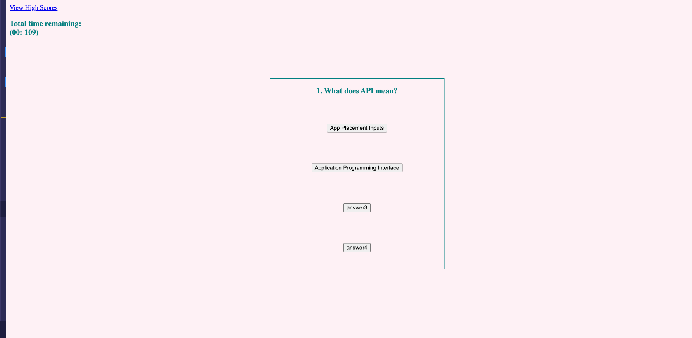

# JavaScript/API Quiz

## Description
- Created an Interactive Quiz that shows correct or wrong when an answer is selected.
- A timer that counts down and when the time runs out the game is over. Each wrong answer deducts 10 seconds.
- If all questions are answered or the game is over the score displays.
- You are able to save your scores in a leaderboard.
- Using a combination of HTML, CSS JavaScript and jQuery this application is interactive and saves data to local storage.

Github Repo: https://github.com/MontineSproul/API_Quiz/branches